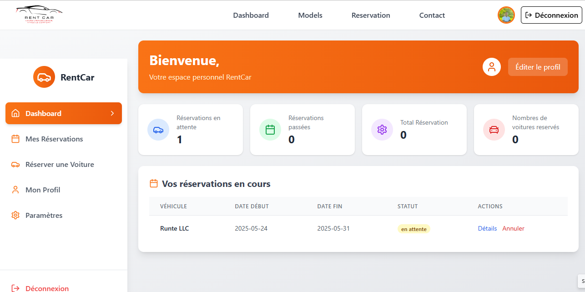
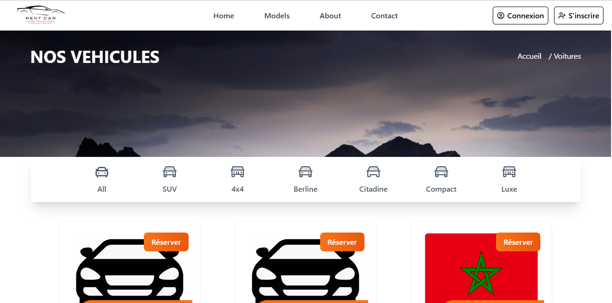
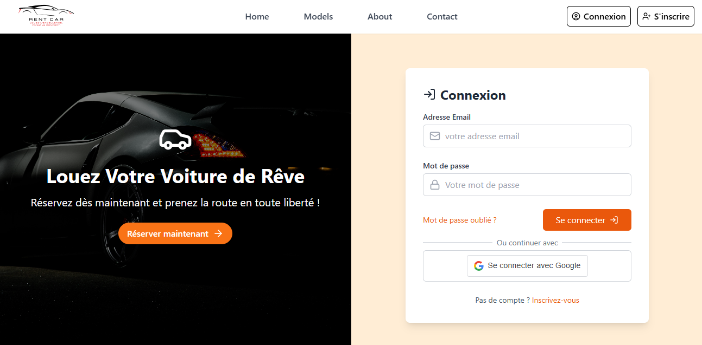
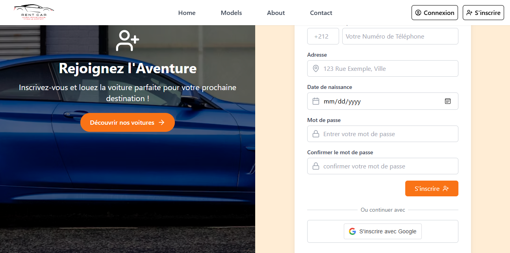

# RENTCAR with React + Tailwindcss + Laravel


Ce projet a été réalisé dans le cadre de notre module de Développement Web.
Il s'agit de Développer une plateforme web intuitive et sécurisée permettant 
aux clients de rechercher, réserver et gérer leurs réservations pour des
fins de location de véhicules en ligne. 
L'application offre également offrir aux administrateurs d'utiliser un système efficace de gestion
des véhicules, des réservations et des utilisateurs sans oublier des interfaces pour 
visualiser les statistiques de réservation, les inscriptions, etc...

*L’architecture est basée sur le modèle MVC (Modèle-Vue-Contrôleur)*, 
favorisant la séparation des responsabilités et la maintenabilité du code, 

**Modèle** : représente les données et les règles métiers (Laravel + MySQL)
**Vue** : interface utilisateur (React.js)
**Contrôleur** : logique de traitement et gestion des requêtes (Laravel API)

L'ensemble est divisé en deux parties, à savoir la partie frontend et la partie backend:
**Partie Frontend** : Faite avec reactJS avec vite + tailwindcss
**Partie Backend** : Faite avec le framework de PHP (*Laravel*) servant comme une *API REST*

---

## 🧩 Fonctionnalités principales
L'Application web dispose d'un système d'authentification robuste utilisant l'adresse mail
et le mot de passe, avec la possibilité de réinitialiser le mot de passe.
L'accès aux fonctionnalités avancées se fait selon les roles de l'utilisateur qui sont :
**admin** et **client**. 
Ainsi pour un visiteur, il a la possibilité de voir les voitures disponibles sur le site 
et leur statut de disponiblité, mais pour faire une réservation, il doit obligatoirement
se connecter.

## Les roles des utilisateurs

### 👤 Côté client :
Rechercher un véhicule (par type, disponibilité, categorie, etc...)

+ Créer un compte et se connecter
+ Consulter les détails du véhicule
+ Réserver un véhicule
+ Gérer ses réservations (modifier, annuler)

### 🛠️ Côté administrateur :

+ Gérer les véhicules (ajout, modification, suppression) selon le modèle CRUD
+ Valider ou annuler les réservations
+ Gérer les utilisateurs
+ Consulter les historiques de réservation et statistiques
+ Gérer les véhicules (selon le modèle CRUD -- ***Create Read Update Delete ***)

---

## 🛠️ Technologies utilisées

+ **Front-end** : ReactJS + Tailwindcss - Interface utilisateur dynamique et réactive
+ **Back-end** : Laravel (API Restful) - Gestion de la logique métier et des requêtes
- **Authentification** : Laravel Sanctum
- **Outils** : Composer, NPM, PHP Artisan, Git
+ **Base de données** : MySQL - Stockage des données relationnelles
+ **Conception** : UML - Modélisation des diagrammes de cas d'utilisation et classes ainsi que le Modèle Conceptuelle de la base de données


## 🚀 Lancer le projet

### ⚙️ Prérequis

Avant de commencer, assurez-vous d’avoir installé :
- [Node.js](https://nodejs.org/)
- [Composer](https://getcomposer.org/)
- [WampServer](https://www.wampserver.com/), [XAMPP](https://www.apachefriends.org/fr/index.html) ou tout autre serveur MySQL local
- PHP 8.1+ avec les extensions requises par Laravel

---

### 1. Cloner le dépôt

```bash
git clone https://github.com/Marcel-Fassou-28/rentcar_project
cd rentcar_project
```

### 2. Préparer la base de données

1. Démarrez votre serveur local MySQL (via Wamp, Xampp, etc.)
2. Importez le fichier SQL suivant dans phpMyAdmin ou tout autre outil :

[📂 rentcar.sql](https://github.com/Marcel-Fassou-28/rentcar_project/blob/master/backend/database/rentcar.sql)

💡 *Le fichier contient des données de test. Vous pouvez également créer vos propres comptes.*

### 3. Configuration du backend (Laravel)
Vous pouvez copier l'example, ou utiliser le fichier [.env](https://github.com/Marcel-Fassou-28/rentcar_project/blob/master/backend/.env) deja créé.

depuis la racine du projet
```bash
cd backend
cp .env.example .env 
```

#### Modifier `.env` :
- Renseignez vos identifiants de base de données :
  ```dotenv
  DB_DATABASE=rentcar
  DB_USERNAME=root
  DB_PASSWORD=  # selon votre configuration locale
  ```

- Mettez à jour l’adresse e-mail du site si nécessaire :
  ```dotenv
  MAIL_USERNAME= (à configurer)
  MAIL_MAILER=smtp
  MAIL_HOST= (à configurer )
  MAIL_PORT=2525
  MAIL_PASSWORD= (à configurer)
  MAIL_FROM_ADDRESS= (à configurer)
  ```

#### Installer les dépendances et lancer le serveur :

```bash
composer install
php artisan key:generate
php artisan migrate
php artisan serve
```
📍 Le backend sera accessible à : [http://127.0.0.1:8000](http://127.0.0.1:8000)

### 4. Lancer le frontend (React)

Depuis la racine du projet :
```bash
cd frontend
npm install
npm run dev
```
📍 Le frontend sera disponible par défaut à : [http://localhost:5173](http://localhost:5173)

## 🔐 Accès administrateur

Utilisez les identifiants suivants pour vous connecter en tant qu'administrateur :
- **Email** : `test@contact.com`  
- **Mot de passe** : `rentcar`

## 📸 Aperçu







---

## Perspectives
Bien que les fonctionnalités principales soient élaborer, mais on peut étendre ce projet en intégrant plusieurs
outils comme :

+ La possibilité de payer immédiatement sur la plateforme;
+ Intégrer des modules qui dès après le paiement de la location de voiture (qui est au préalable
    réservé, fourni la localisation du véhicule au client avec système de code fourni)
+ Intégrer des fonctionnalités avancées comme le machine learing pour analyser les données via 
    les actions de l'utilisateur afin de maximiser les profits et d'avoir une clientèle fidèle.
+ Offir à l'administration du site, la possibilité de connaitre la localisation d'un véhicule
    en temps réels, pour éviter et prévenir des cas de vols.
+ Intégrer un chatbot pour guider les utilisateurs dans le choix du véhicule à reserver

## Contributeur
+ Marcel Fassou Haba [Github](https://github.com/Marcel-Fassou-28)
+ Mohamed Msaboue [Github](https://github.com/momomsb)
+ Claude Youmini Ngougou [Github](https://github.com/NGONORMALIA)

***Tous droits réservés***